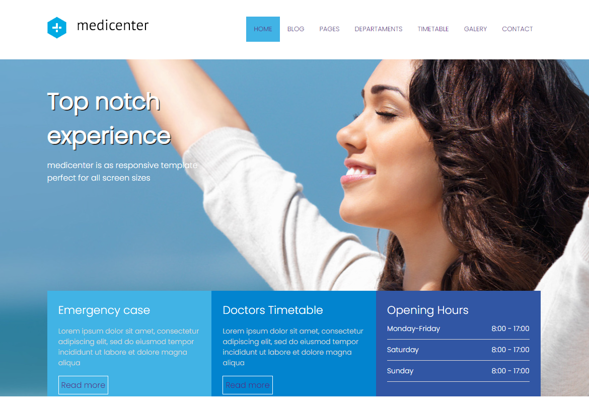
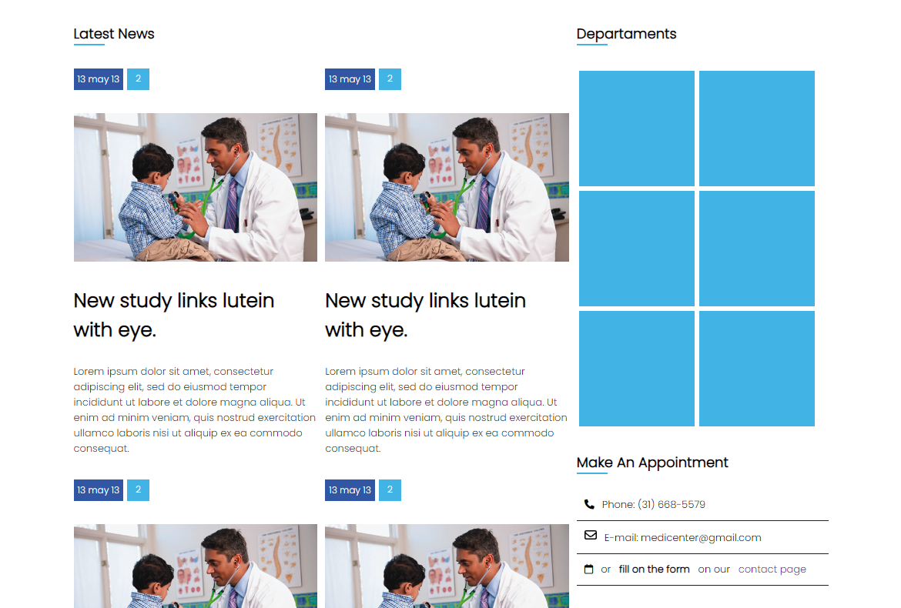
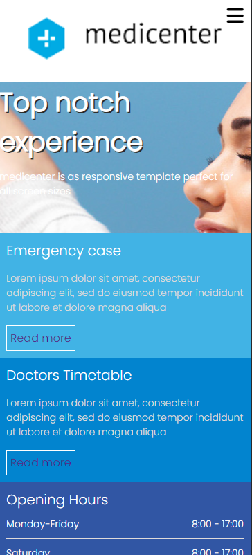
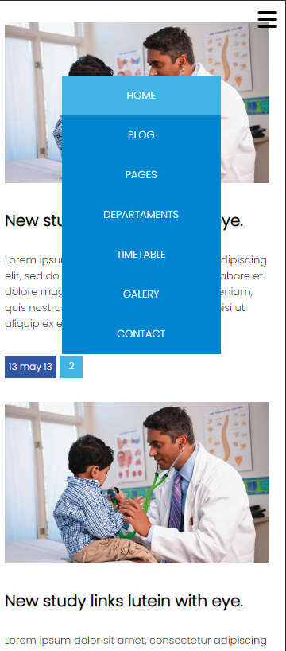

 <h1 align="center">Landing Page</h1>
 <h2 align="center">Programador Front-End</h2>
 
 

    
 

 

    
 

 

    
 

 

    
 

 ## 🚀 Tecnologias

 Esse projeto foi desenvolvido com as seguindes tecnologias:

 - HTML - CSS - JavaScript
 - GitHub
 - Visual Studio Code

 ## Projeto 
 <a href="https://kassio07.github.io/Landing-Page/">Link do Projeto</a>

 Fiz esse projeto com o intuito de expandir minhas habilidades com as tecnologias citadas acima.

 ## :memo: Licença 

 Esse projeto está sobre a licença MIT.

